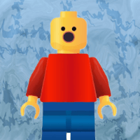
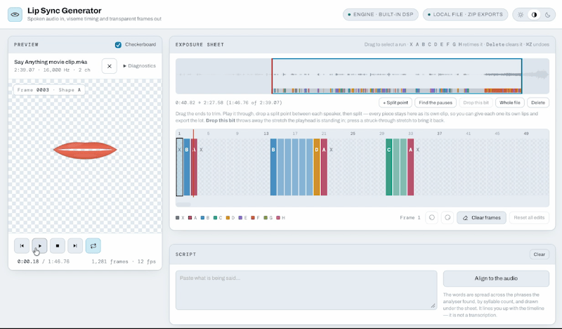

# Lip Sync Generator

**Spoken audio in, viseme timing and transparent frames out.**

One HTML file. Open it in a browser and it works — no install, no account, no
server, nothing uploaded. Give it a voice track and it works out which mouth
shape belongs on every frame, shows you the result as an exposure sheet you can
correct by hand, and writes the mouths out in whatever form your animation tool
wants.
## Demos:
[](https://dougalder.github.io/lip-sync-generator/) [](https://dougalder.github.io/lip-sync-generator/) [](https://dougalder.github.io/lip-sync-generator/)

[](https://dougalder.github.io/lip-sync-generator/)


## 📖 The manual

| | |
|---|---|
| **[docs/manual.md](docs/manual.md)** | The full manual, in Markdown. Renders right here on GitHub. |
| **[docs/index.html](docs/index.html)** | The same manual as a styled page, for GitHub Pages or reading offline. |

The two are checked against each other, so neither can quietly drift.

**"How do I actually get the lips onto my puppet?"** —
[Putting the lips on a puppet](docs/manual.md#putting-the-lips-on-a-puppet)
walks through ToonSquid, Procreate Dreams, iMovie, Final Cut Pro, and finishing
the clip in the page itself without any other software.

---

## What it's for

- a stop-motion puppet or minifigure that needs a mouth for each frame
- a 2D character in After Effects, Blender, Spine or a game engine
- a talking head in Final Cut Pro, cut over real footage
- a two-hander conversation split into lines, each with its own mouth

## Quick start

1. Open `lip-sync-generator.html` in Chrome, Edge, Safari or Firefox.
2. Drop a voice recording onto the **Preview** panel.
3. Wait a second — the exposure sheet fills in.
4. Press <kbd>Space</kbd> to watch it.
5. Go to **Export** and take whichever format you need.

> **Shortest useful path:** drop a WAV, press play, export the
> **Chart + exposure sheet**. Nine transparent PNGs and a JSON/CSV timing list,
> which is enough to drive almost any animation tool.

## What it can do

- **Two analysers** — a built-in formant DSP that is instant and tunable, and
  Rhubarb (PocketSphinx) for comparison
- **An exposure sheet you can edit** — select a run, press a letter, done. Hand
  edits survive a frame-rate change, a trim, and switching between clips
- **Trim, split and drop** on the waveform — cut a conversation into one clip
  per line, throw away the bits you don't want, bring them back if you change
  your mind
- **A queue** — up to 24 clips, each keeping its own edits, placement and mouth
- **Fifteen drawn mouth styles**, each in three head angles — front,
  three-quarter and profile — plus your own pictures
- **Place the mouth on the video**, with keyframes to follow a moving shot and a
  blur patch to cover a printed mouth
- **Eight export formats** — chart + timing, Final Cut Pro project, transparent
  GIF, animated PNG with a real alpha channel, sprite sheet, frame sequence,
  chroma-key MP4, and video with the mouth burned in
- **Batch any of them** across the whole queue, as one download

See the [manual](docs/manual.md) for how each of these works, with annotated
screenshots.

## Limits

| | |
|---|---|
| Clips in the queue | 24 |
| Length of a queued clip | 60 seconds |
| Size of one batch download | 600 MB |

The single-clip path has no limit and is always the fallback.

## Privacy

Nothing is uploaded. There is no server, no account, no analytics, and **no
network request of any kind** — not for your media, not for fonts, not for
anything. Everything the page needs travels inside it. You can put it on a USB
stick and use it on a machine with no network at all.

`offlinetest.py` holds that claim to account: it watches every request the page
makes, and it loads the file a second time from a `file://` URL with the network
refused outright, then analyses a clip to prove it still works.

## Built from

| | |
|---|---|
| **Rhubarb engine** | [`lip-sync-engine`](https://github.com/biolimbo/lip-sync-engine) 1.0.3 (npm, MIT) — a ready-made WebAssembly build of [Rhubarb Lip Sync](https://github.com/DanielSWolf/rhubarb-lip-sync) by Daniel Wolf (MIT). |
| **Speech model** | The standard CMU Sphinx US English acoustic model (© 2015 Alpha Cephei Inc., BSD), unmodified. |
| **Typefaces** | [Archivo](https://github.com/Omnibus-Type/Archivo) and [DM Mono](https://github.com/googlefonts/dm-mono), both SIL Open Font License 1.1, embedded in the file. |

A few notes on the above, since they are the kind of thing people ask:

- **The WASM was not compiled here.** It is the published `lip-sync-engine`
  build, byte-identical to the package on npm (verified by hash). No Emscripten
  was run for this project; that package's author builds it in GitHub Actions,
  and neither the package nor its repository declares the Emscripten version.
- **No Rhubarb version is claimed**, because the port does not state which
  release it derives from. What can be said from the binary is that it vendors
  `sphinxbase-rev13216` and `pocketsphinx-rev13216`.
- **The acoustic model is not trimmed.** What was removed is two files of the
  36.1 MB bundle that only the transcript-driven path ever opens:
  `en-us.lm.bin` (25.9 MB word language model) and `cmudict-en-us.dict` (3.1 MB
  pronunciation dictionary). Everything the phonetic recogniser reads — the
  acoustic model and `en-us-phone.lm.bin` — is byte-for-byte the original.
  36.1 MB down to 7.1 MB, with nothing the engine uses altered.

---

## Repository layout

```
lip-sync-generator.html     the app — this is the whole thing
docs/
  manual.md                 the manual, in Markdown
  index.html                the manual, as a page
  images/                   annotated screenshots
fonts/                      the two typefaces, embedded at build time
lips/                       optional: your own mouth sets, one folder each
manualshots.py              regenerates the screenshots
manualtest.py               checks the manual against the app
offlinetest.py              proves the file makes no network request
```

The manual's screenshots are generated, not taken by hand: `manualshots.py`
drives the app with Playwright and draws each callout at the real bounding box
of the control it names. Re-run it after a UI change and the numbers follow the
buttons — or it fails, if a control it points at no longer exists.

`manualtest.py` then checks the manual against the running app: that every named
control really is on the page, that every promised shortcut fires, that the
quoted limits match the constants in the code, and that the Markdown and HTML
versions still say the same things.
