# Lip Sync Generator — User Manual

**Spoken audio in, viseme timing and transparent frames out.**

> This is the same manual as [`index.html`](index.html), in Markdown so it
> renders on GitHub. The two are checked against each other — same sections,
> same pictures, same numbered keys — so neither can quietly drift.

---

## Contents

- [What it does](#what-it-does)
- [Getting started](#getting-started)
- [The window](#the-window)
- [Loading a clip](#loading-a-clip)
- [Analysis](#analysis)
- [Preview and transport](#preview-and-transport)
- [The exposure sheet](#the-exposure-sheet)
  - [The nine shapes](#the-nine-shapes)
  - [Fixing frames by hand](#fixing-frames-by-hand)
- [Trim, split and drop](#trim-split-and-drop)
- [Working on several clips](#working-on-several-clips)
- [Mouth style](#mouth-style)
  - [Different lips per clip](#different-lips-per-clip)
  - [Your own lips](#your-own-lips)
- [Placing the mouth](#placing-the-mouth)
- [Blur patch and keyframes](#blur-patch-and-keyframes)
- [Script](#script)
- [Exporting](#exporting)
  - [The eight formats](#the-eight-formats)
  - [Batch export](#batch-export)
- [Putting the lips on a puppet](#putting-the-lips-on-a-puppet)
  - [ToonSquid and Procreate Dreams](#toonsquid-and-procreate-dreams-ipad)
  - [iMovie](#imovie-on-mac-or-ipad)
  - [Final Cut Pro](#final-cut-pro)
  - [Straight from here](#straight-from-here-with-nothing-else)
- [Keyboard shortcuts](#keyboard-shortcuts)
- [Limits](#limits)
- [Troubleshooting](#troubleshooting)
- [Privacy](#privacy)

---

## What it does

You give it a voice track. It works out which mouth shape belongs on every
frame, shows you the result as an exposure sheet you can correct by hand, and
writes the mouths out in whatever form your animation tool wants.

It is one HTML file. Open it in a browser and it works — no install, no account,
no server. The audio never leaves the page.

Typical jobs it is built for:

- a stop-motion puppet or minifigure that needs a mouth for each frame
- a 2D character in After Effects, Blender, Spine or a game engine
- a talking head in Final Cut Pro, cut over real footage
- a two-hander conversation split into lines, each with its own mouth

---

## Getting started

1. Open `lip-sync-generator.html` in Chrome, Edge, Safari or Firefox.
   Double-clicking the file works; so does serving it.
2. Drop a voice recording onto the **Preview** panel.
3. Wait a second or two — the exposure sheet fills in.
4. Press <kbd>Space</kbd> to watch it.
5. Go to the **Export** tab and take whichever format you need.

> **Shortest useful path**
>
> Drop a WAV, press play, export the **Chart + exposure sheet**. You get nine
> transparent PNGs and a JSON/CSV timing list, which is enough to drive almost
> any animation tool.

---

## The window

Three strips, top to bottom: the title bar, the working deck (preview on the
left, exposure sheet on the right), and the tabbed controls.

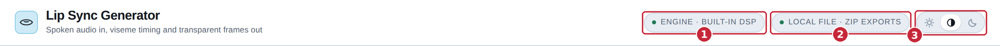

1. **Engine** — which analyser is running. Built-in DSP by default.
2. **Source** — where the file came from and how exports will be handed back.
   `Local file · ZIP exports` is the normal case.
3. **Appearance** — light, match the system, or dark. It sticks between visits.

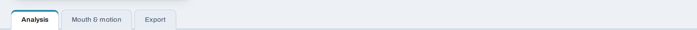

The three tabs. Arrow keys move between them when one has focus.

Everything above the tabs stays on screen whichever tab you are in, so you can
scrub the clip while you adjust a setting.

---

## Loading a clip

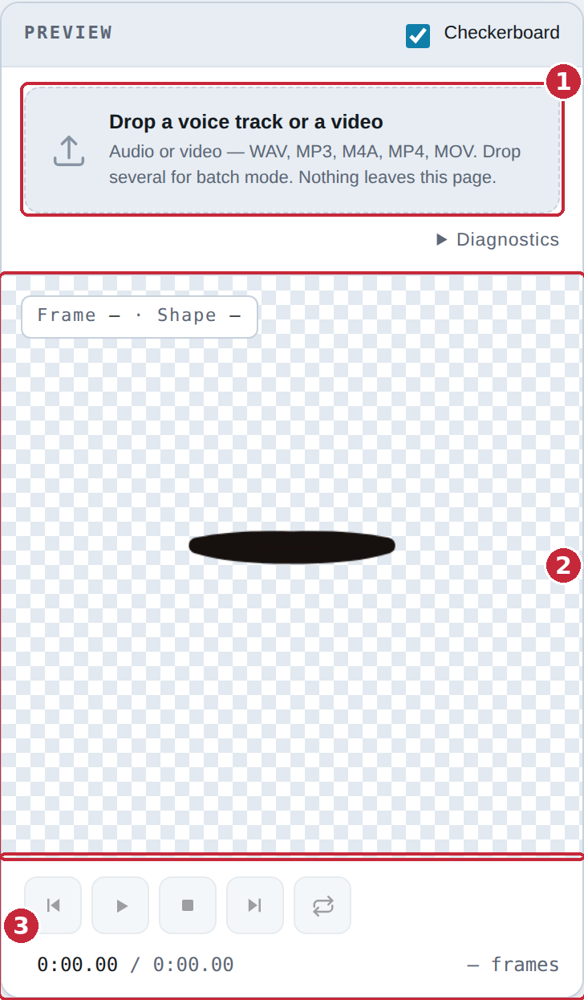

1. **Drop area** — drag a file here, or click to browse. WAV, MP3, M4A, OGG,
   FLAC, AAC, MP4, MOV, WebM. Drop several at once to start a queue.
2. **Stage** — where the mouth is drawn, over a checkerboard so you can see the
   transparency. With a video loaded, the mouth sits over the picture.
3. **Transport** — play, stop and scrub. Greyed out until a clip is in.

A **video** file is treated the same way: the soundtrack is analysed and the
picture becomes the backdrop, so you can place the mouth exactly where the face
is. If the browser cannot decode the picture, the audio still works and a note
says so.

---

## Analysis

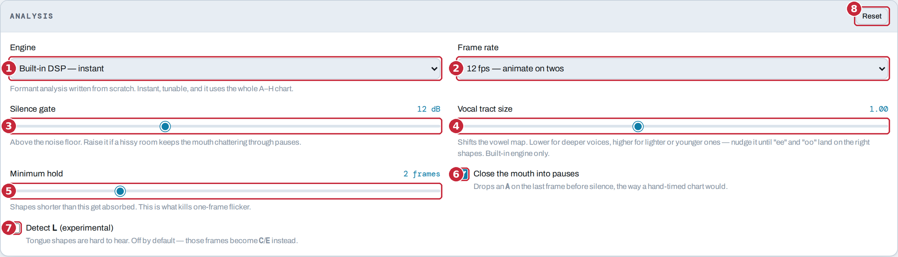

1. **Engine** — **Built-in DSP** is formant analysis written from scratch:
   instant, tunable, and it uses the whole A–H chart. **Rhubarb** is the
   PocketSphinx-based analyser, slower and less tunable, included for
   comparison.
2. **Frame rate** — the rate your animation runs at. 12 fps ("on twos") is the
   usual choice for character animation; 24, 25 and 30 are there for film and
   video. **Set this before you start hand-editing**, since changing it re-times
   everything.
3. **Silence gate** — how far above the noise floor counts as speech. Raise it
   if a hissy room keeps the mouth chattering through pauses.
4. **Vocal tract size** — shifts the vowel map. Lower for deeper voices, higher
   for lighter or younger ones. Nudge it until "ee" and "oo" land on the right
   shapes. Built-in engine only.
5. **Minimum hold** — shapes shorter than this get absorbed into their
   neighbours. This is the control that kills one-frame flicker.
6. **Close the mouth into pauses** — drops an `A` on the last frame before
   silence, the way a hand-timed chart would. On by default.
7. **Detect L** — tongue shapes are genuinely hard to hear, so this is off by
   default and those frames become `C` or `E` instead. Turn it on and check the
   result.
8. **Reset** — puts every analysis setting back to its default.

> **Which knob first**
>
> If the mouth flaps during silence, raise the **silence gate**. If it flickers
> during speech, raise the **minimum hold**. If the vowels are simply wrong —
> "oo" coming out as "ah" — that is **vocal tract size**.

---

## Preview and transport

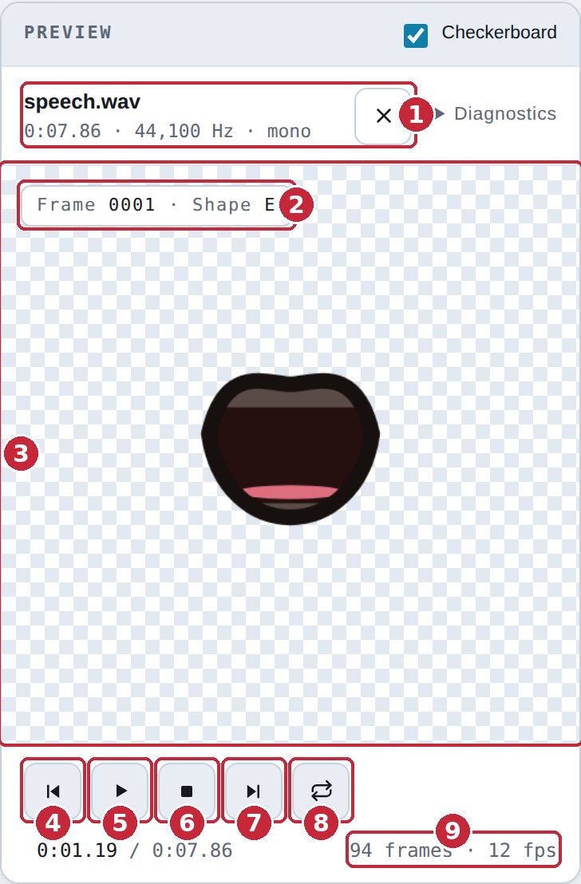

1. **The loaded file** — name, length, sample rate and channels. The **×**
   clears it. **Diagnostics** beside it opens a technical readout you can copy
   if something needs reporting.
2. **Frame and shape** — which frame the playhead is on and which mouth shape is
   showing.
3. **Stage** — the mouth, drawn at the current frame. Click a cell in the
   **Chart** to preview any shape here.
4. **Jump to the start** — also <kbd>Home</kbd>.
5. **Play / pause** — also <kbd>Space</kbd>.
6. **Stop** — stops and rewinds.
7. **Jump to the end** — also <kbd>End</kbd>. Lands one frame short of the very
   end, because seeking to the last instant leaves most browsers showing black.
8. **Loop** — plays the clip round and round. Respects a trim.
9. **Frame count** — how many frames the clip is at the current rate.

---

## The exposure sheet

This is the working document: one cell per frame, coloured and lettered by mouth
shape, with the waveform above it.

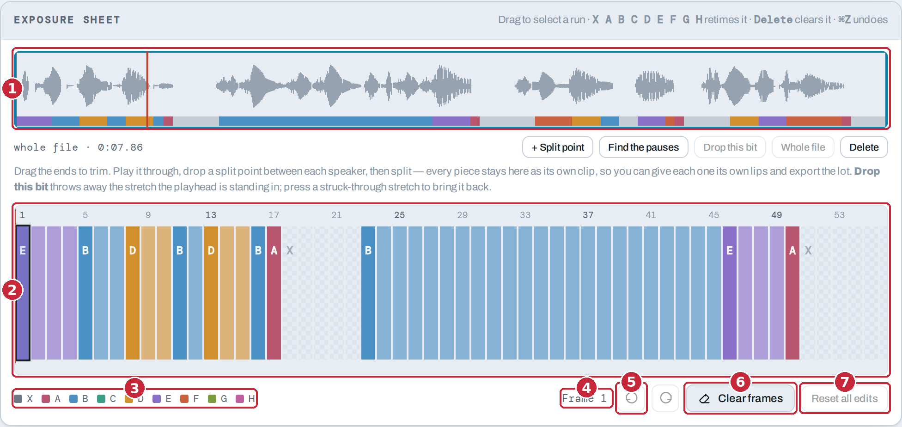

1. **Waveform** — the whole clip at a glance, with the shapes as a colour band
   underneath. Press anywhere to seek. It is also where trimming and splitting
   happen — see [Trim, split and drop](#trim-split-and-drop).
2. **The sheet** — one cell per frame. Drag across it to select a run. Scrolls
   sideways on a long clip.
3. **Legend** — which colour is which shape.
4. **Selection** — what is selected right now, in frames and seconds.
5. **Undo / redo** — also <kbd>⌘Z</kbd> and <kbd>⇧⌘Z</kbd> (<kbd>Ctrl</kbd> on
   Windows).
6. **Clear frames** — empties the selected frames back to rest.
7. **Reset all edits** — throws away every hand edit and returns to the raw
   analysis.

### The nine shapes

The Preston Blair set, which is also what Rhubarb writes. Every export ships all
nine PNGs even if the take only used five, so you can correct a frame later
without exporting again.

| Key | Shape | Sounds |
|-----|-------|--------|
| `X` | Rest | silence |
| `A` | Closed | M, B, P |
| `B` | Slightly open | S, T, D, K, N, R, and "ee" |
| `C` | Open | "eh", "ae" |
| `D` | Wide open | "aa" |
| `E` | Rounded | "o", "aw", "er" |
| `F` | Puckered | "oo", W |
| `G` | Teeth on lip | F, V |
| `H` | Tongue | L |

### Fixing frames by hand

The analyser gets most of it. The last five per cent is yours:

1. Drag across the sheet to select the frames you want to change.
2. Press the letter of the shape you want — <kbd>A</kbd>…<kbd>H</kbd>, or
   <kbd>X</kbd> for rest. The whole selection changes.
3. <kbd>Delete</kbd> clears a selection back to rest.
4. <kbd>⌘Z</kbd> undoes.

Hand edits survive everything except **Reset all edits**: they are kept when you
change the frame rate, switch to another clip and back, or trim.

---

## Trim, split and drop

All of this happens on the sheet's own waveform. It draws **the whole source
file**, with the part you are keeping boxed and anything discarded shaded and
struck through — so a piece you have cut off is still on screen and can be
brought back.

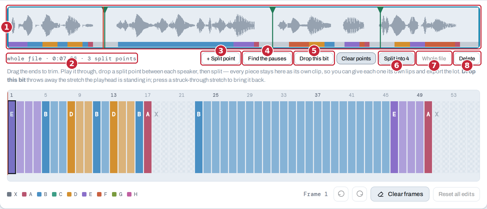

1. **The waveform** — drag either **end** to trim. Press anywhere else to seek.
   The green flags along the top are split points: **drag a flag** to move it,
   **press and release without moving** to take it off.
2. **Readout** — what is kept, out of how long, and how many split points are
   down.
3. **+ Split point** — puts a split point where the playhead is.
4. **Find the pauses** — puts one in every pause the analyser found. This is
   usually the whole job on a conversation.
5. **Drop this bit** — throws away the stretch the playhead is standing in,
   bounded by the split points either side. The audio is genuinely removed and
   everything after it moves earlier. Press the struck-through stretch to bring
   it back.
6. **Split into N** — cuts at every split point at once. Each piece becomes its
   own clip in the queue, sharing the same source file.
7. **Whole file** — undoes the trim and restores every dropped stretch.
8. **Delete** — removes this clip.

> **Two people talking**
>
> Load the recording, press **Find the pauses**, check the flags are in the
> right gaps, then **Split**. You get one clip per line. Now give the first
> speaker their mouth and press **Every other clip**
> (see [below](#different-lips-per-clip)), then do the same from the second
> clip.

Split points are marked first and cut all at once on purpose. Cutting
immediately at the playhead would mean hunting for the right piece before you
could place the next cut.

---

## Working on several clips

Drop several files, or split one, and a queue appears in the Preview panel. Only
one clip is open at a time; the rest keep their own edits, placement and mouth
until you come back to them.

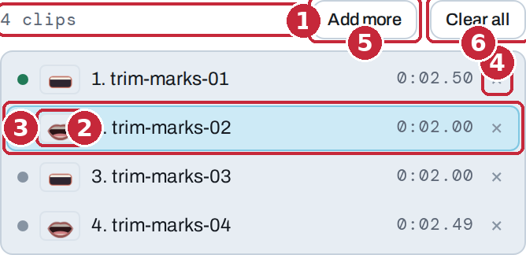

1. **Count** — how many clips are loaded.
2. **Lips** — the mouth that clip will be drawn with. This is what lets you see
   at a glance that two speakers are alternating.
3. **The open clip** — highlighted. Click any row to open it.
4. **×** — takes that clip out of the queue.
5. **Add more** — adds files to the queue.
6. **Clear all** — empties it.

Shared across the queue: the engine, the frame rate and the analysis settings.
Per clip: the frames and hand edits, the mouth style, the placement, the
keyframes, the blur patch and the script.

---

## Mouth style

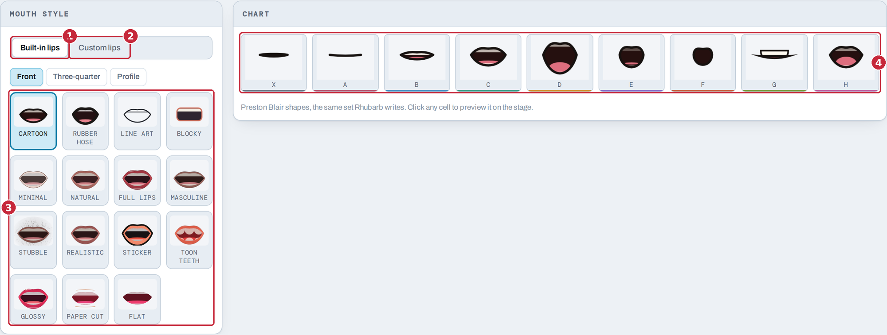

1. **Built-in lips** — fifteen drawn styles, from a plain line to a rendered
   mouth, each in three head angles: **Front**, **Three-quarter** and
   **Profile**.
2. **Custom lips** — sets of pictures, either shipped with the app or added for
   this visit. See below.
3. **The styles** — click one to use it. With a queue up it applies to the open
   clip only.
4. **Chart** — all nine shapes in the current style. Click a cell to preview it
   on the stage.

#### Head angles

A mouth chart belongs to a head angle: the same nine shapes drawn for a
character facing the camera are wrong on one that has turned. The turned views
are rebuilt geometry rather than the front view squashed. Three-quarter
foreshortens the far half and tucks that corner behind the cheek. Profile is
drawn from scratch: an upper lip and a lower one, each a lobe running from the
mouth corner out to a rounded free edge, with the dark of the mouth between them
running clean out of the face — front-on the opening is a hole ringed by lip,
and from the side it is not a hole at all. Width becomes protrusion, the jaw
carries the opening and takes the mouth corner down with it, and a pucker
gathers the lips into a cone with a small round hole at the very front.

Both turned views face **right**. Because the styles match across all three, a
character can keep its look through a turn — put the front set on one clip and
the three-quarter on the next. The pane opens on **Built-in lips** and **Front**
every time, whichever tab and angle you were last using.

Two things to expect:

- **Profile reads less precisely than front-on**, and that is true of profile
  lip sync generally rather than a limitation here. Front-on, `B` `C` and `D`
  differ mainly by how wide the mouth opens, and from the side that difference
  largely disappears. What survives is jaw travel and lip protrusion, so `A`,
  `F` and `G` still read strongly while the open vowels sit closer together.
- **The angle control is not a substitute.** It turns the mouth in the picture
  plane; a real turn foreshortens it and hides the far corner.

### Different lips per clip

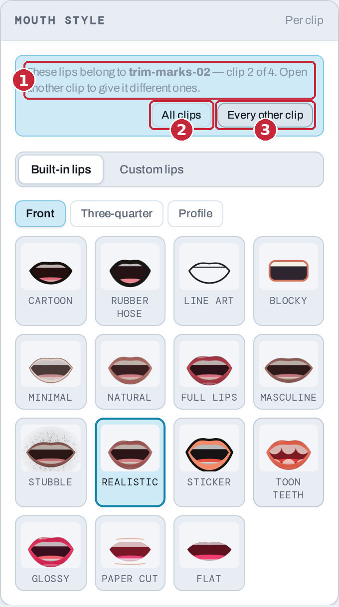

1. **Whose lips these are** — the picker belongs to the clip that is open. Open
   another clip to give it different ones.
2. **All clips** — give every clip in the queue these lips.
3. **Every other clip** — give them to this clip and every second one after it.
   This is the two-speakers-taking-turns case that splitting on the pauses
   produces.

### Your own lips

1. **The sets** — anything found in a `lips/` folder beside the HTML file when
   the page loaded, plus anything you have added this visit. A set showing `7/9`
   has two shapes no picture was named for; they are filled with a best guess.
2. **Use my own lips…** — pick a folder of nine pictures named for the shapes:
   `X A B C D E F G H`. It stays on this page for this visit only. Nothing is
   uploaded, nothing is stored, and reloading clears it.
3. **Match pictures to shapes…** — say which picture is which, by hand.

#### When the names don't say which shape is which

Pictures are matched to shapes by filename: a letter on its own, so `mouth-D.png`,
`D.png` and `04_D_wide.png` all land on `D`. When a name says nothing — a folder
of `frame01.png … frame09.png`, or one that calls its wide-open shape `aah` —
the leftovers are handed out in name order, counting numerically, which puts a
folder numbered in chart order (`X A B C D E F G H`) right on its own.

Where that guess is wrong, **Match pictures to shapes…** opens a list of the nine
shapes with a chooser on each: pick any picture in the folder for any shape, and
the chart, the stage and every export follow as you go. Shapes nobody named a
picture for are marked, so you can see which ones were a guess and which you
chose. **Match by name again** throws away your choices and re-runs the automatic
match.

It opens by itself right after an import that left anything to guess at, which is
the moment you still remember what is in the folder. A folder named for the
shapes is already right, so it stays out of the way.

> **Shipping your own sets**
>
> To have sets appear for everyone automatically, put them in a `lips/` folder
> next to the HTML file — one sub-folder per set, nine pictures inside each,
> named for the shapes. They are found on load. This only works when the page is
> served over HTTP; opening the file directly from disk blocks the folder scan,
> and the **Use my own lips…** button is the way in.

---

## Placing the mouth

With a video loaded, the mouth is placed directly on the picture.

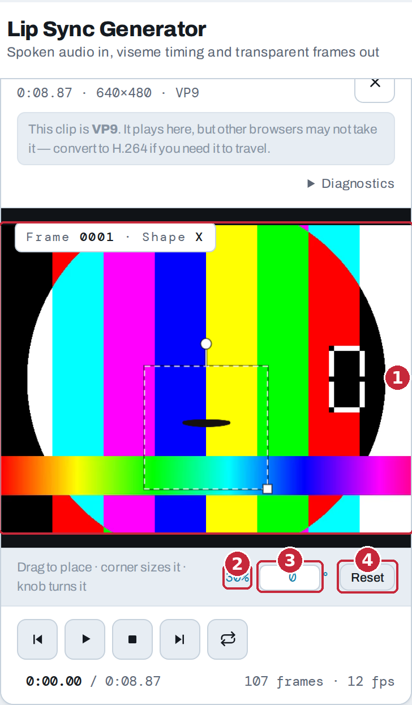

1. **The stage** — **drag** the mouth to move it, drag the **corner** to size
   it, and drag the **knob** to turn it. Hold <kbd>Shift</kbd> while turning to
   snap to 15°.
2. **Size** — as a percentage of the frame.
3. **Angle** — type an exact number of degrees if you would rather.
4. **Reset** — back to the centre at the default size, square on.

The placement is **baked into the exported pictures**. A Final Cut project or a
frame sequence drops onto your timeline at 100% and lands exactly where the
preview showed it — no transform needed at the other end.

---

## Blur patch and keyframes

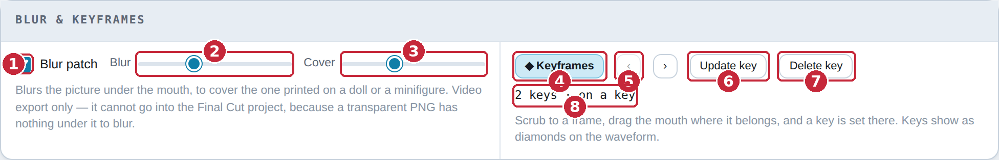

1. **Blur patch** — blurs the picture underneath the mouth, to cover the one
   printed on a doll or a minifigure.
2. **Blur** — how strong.
3. **Cover** — how much area it covers.
4. **Keyframes** — turns keyframing on, so the mouth can follow a moving shot.
5. **‹ ›** — jump to the previous or next key.
6. **Set key** — puts a key at the current frame.
7. **Delete key** — removes the key you are standing on.
8. **Count** — how many keys are down.

Both appear once a video is loaded.

With keyframes on, scrub to a frame and drag the mouth where it belongs — a key
is set there automatically. Keys show as diamonds on the waveform, and they are
anchored to *time*, so changing the frame rate or trimming the clip leaves them
where they were.

> ⚠️ **Where these two do and do not go**
>
> The blur patch and keyframed motion are baked into **Video with mouth
> overlay** only. They cannot go into the Final Cut project, because a
> transparent PNG has nothing underneath it to blur — and animating a position
> is something Final Cut does well, on a clip you can see.

---

## Script

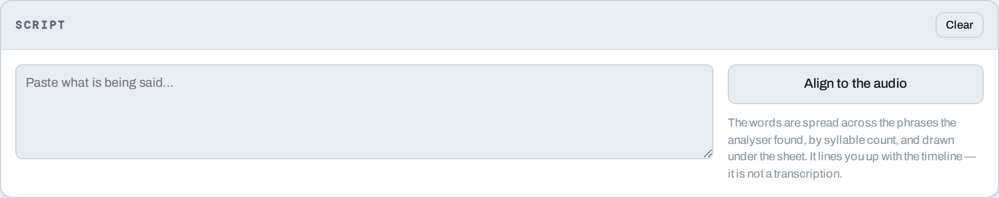

Paste what is being said and press **Align to the audio**. The words are spread
across the phrases the analyser found, by syllable count, and drawn under the
sheet.

It is a way of finding your place on a long clip — "this is the bit where she
says the name" — not a transcription, and not something the analysis uses.

---

## Exporting

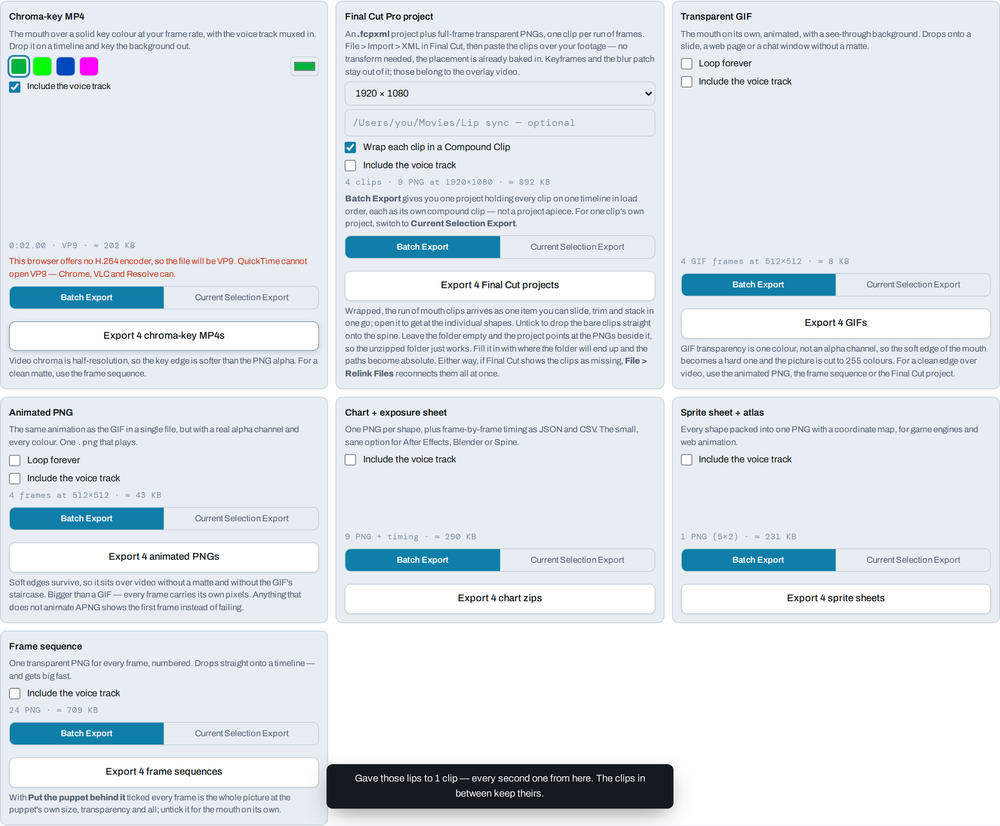

Every format is a card, and every card carries its own options and its own
button. Read the card, set what it offers, press the button at the bottom of it.

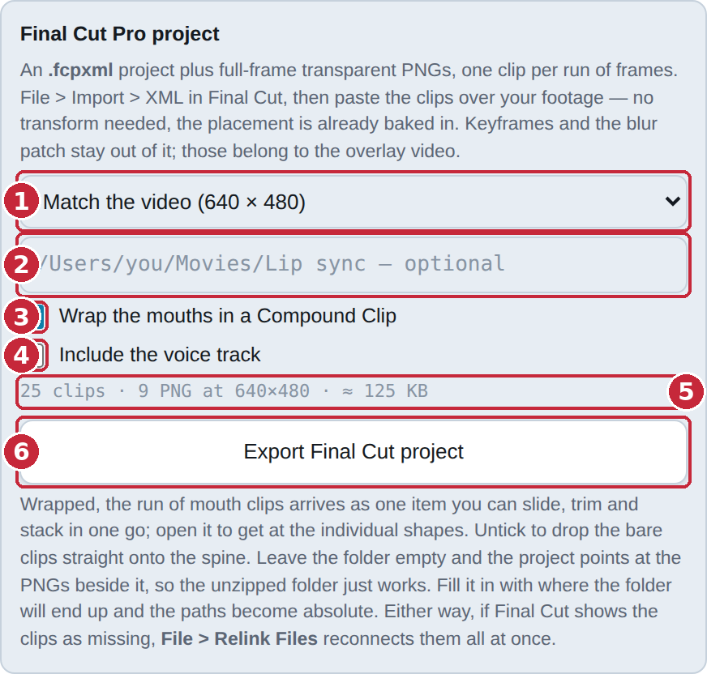

1. **Frame size** — the timeline the project will be built for. "Match the
   video" appears when a video is loaded and is the right answer when you are
   cutting over that footage.
2. **Media folder** — leave it empty and the project points at the pictures
   beside it, so the unzipped folder just works. Fill in where the folder will
   end up and the paths become absolute instead.
3. **Wrap … in a Compound Clip** — the run of mouths arrives as one item you can
   slide, trim and stack, instead of dozens of one-frame pieces. Double-click it
   in Final Cut to get at the individual shapes, or
   **Clip > Break Apart Clip Items** to lay them out loose.
4. **Include the voice track** — puts the audio in the zip beside the pictures.
   Off by default. Every card has its own.
5. **Estimate** — roughly what you are about to get, before you commit.
6. **The button** — does the export. It always says what it is about to do.

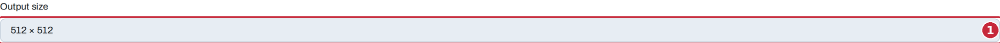

1. **Output size** — the pixel size of the mouth pictures, used by the GIF,
   sprite sheet, frame sequence and chart exports. The Final Cut project,
   chroma-key MP4 and overlay video have their own size on their own cards,
   because those are frame sizes rather than mouth sizes.

### The eight formats

| Format | You get | Good for |
|--------|---------|----------|
| **Chart + exposure sheet** | Nine transparent PNGs plus frame-by-frame timing as JSON and CSV | After Effects, Blender, Spine — the small, sane option, and the one to reach for first |
| **Final Cut Pro project** | An `.fcpxml` project plus full-frame transparent PNGs, one clip per run of frames | Cutting over real footage in Final Cut. Import > XML and paste over your clip |
| **Transparent GIF** | An animated GIF with a see-through background | A slide, a web page, a chat window — anywhere without a matte |
| **Animated PNG** | The same animation as one `.png` file, with a real alpha channel | Anywhere the GIF's hard edge shows. Three times the size of the GIF and worth it over video |
| **Sprite sheet + atlas** | One PNG with all nine shapes packed in, plus a coordinate map | Game engines and web animation |
| **Frame sequence** | One numbered transparent PNG for every frame | Dropping straight onto a timeline. The cleanest matte — and it gets big fast |
| **Chroma-key MP4** | The mouth over a solid key colour, voice track muxed in | Any editor that can key. Note the chroma is half-resolution, so the edge is softer than the PNG alpha |
| **Video with mouth overlay** | Your source video with the mouth burned into it | A finished clip in one step. The only export that carries the blur patch and keyframed motion |

> **Everything ships the whole set**
>
> Even if a take never uses `G` or `H`, those pictures are in the zip. That is
> what lets you correct a frame in your editor a week later without coming back
> here.

### Batch export

With more than one clip loaded, every card grows a two-way switch.

1. **Batch Export** — runs this format across every clip in the queue, analysing
   any that have not been yet, and using each clip's own edits, placement and
   mouth.
2. **Current Selection Export** — does the open clip only.
3. **The button** — says which it is about to do, and how many.
4. **Card note** — anything that differs between the two, spelled out.

Each card decides for itself, so you can batch the GIFs while pulling a single
Final Cut project for the clip in front of you.

1. **Count** — how many clips a batch will cover.
2. **What a batch does** — including which clip "current selection" means right
   now.
3. **Status** — progress during a run, and a **Stop** button beside it.

#### What a batch hands you

**One download**, a zip with a folder per clip inside it. Not one download per
clip — a browser will only let a page start one download from a click, and the
rest get dropped or blocked, which looks exactly like "only the first clip
exported".

**Final Cut is the exception**, because its batch output is naturally a single
document: you get one project holding every clip on one timeline in load order,
each as its own compound clip — not a project apiece. For one clip's own
project, switch that card to **Current Selection Export**.

**Video with mouth overlay is never batched.** It renders roughly as long as the
clip runs, so it stays on the open clip whatever the other cards say.

Stopping mid-run still gives you a zip of whatever finished.

---

## Putting the lips on a puppet

This app makes the mouth. Joining it to the puppet is the next program's job, and
every one of them does it differently.

Wherever you do it, two things have to be true: the mouth sits on its own layer
**above** the puppet, and something keeps the two together when the puppet moves.
Which export to take is mostly a question of which of those the tool can manage.

| Working in | Take | Because |
|---|---|---|
| ToonSquid | **Transparent GIF**, or **Frame sequence** | It animates a GIF, and imports a run of PNGs as consecutive drawings |
| Procreate Dreams | **Transparent GIF** | An animated GIF arrives as a Flipbook |
| iMovie, and most Windows editors | **Transparent GIF**, or **Chroma-key MP4** | Picture in Picture, or the green-screen mode |
| Anything that reads an **Animated PNG** | **Animated PNG** | One file, real alpha, no hard edge — try it before settling for the GIF |
| Final Cut Pro | **Final Cut Pro project** | It builds the timeline for you, and can track a moving face |
| After Effects, Blender, Spine, a game engine | **Chart + exposure sheet** or **Frame sequence** | Timing as data, or one PNG per frame |
| Nothing — you just want a finished clip | **Video with mouth overlay** | Done here, in one step |

Take the voice track with it unless the audio is already in your project — every
card has its own **Include the voice track**.

> **Why there is no alpha movie**
>
> An HEVC `.mov` with an alpha channel is the file an iPad animation app would
> most like to be handed, and this page cannot make one. Chromium answers
> "Alpha encoding is not currently supported" to every codec it has, and Apple's
> HEVC-with-alpha is built by Apple's own tools. The **Animated PNG** is the
> nearest a browser can get on its own: one file, eight bits of alpha, no codec
> involved. For a real alpha movie, take the **Frame sequence** and convert it
> outside.

### ToonSquid and Procreate Dreams (iPad)

Import the mouths and the voice track, drag them into the timeline above your
puppet, and resize and position them there.

Both can keep the mouth attached to the body so the two travel together, which is
worth setting up before you animate anything:

- **ToonSquid** calls it the **transform hierarchy** — the button in the
  timeline's bottom toolbar. Drag the mouth layer onto the body layer to make it
  a child, and scaling, rotating or moving the body does the same to the mouth.
  Layers inside a group are already in an implicit hierarchy with the group as
  their parent.
- **Procreate Dreams** groups instead: select the tracks in Timeline Edit, tap
  and hold, then **Group**. Movement, effects and filters applied to the group
  reach everything in it.

Either app will take the **Transparent GIF**, which is the quickest route: Dreams
reads an animated GIF as a Flipbook, and ToonSquid animates one too.

ToonSquid has a second route worth knowing about. Its **Image Sequence** import
takes a selected run of images, in filename order, and lays them out as
consecutive drawings on one animation layer — one mouth per drawing, the way you
would have drawn them yourself. Take the **Frame sequence** for that. It is more
files to shepherd, but the mouths arrive as real drawings you can paint on rather
than as a video clip, and the transparency is a full eight bits instead of the
GIF's on-or-off.

### iMovie, on Mac or iPad

Stack the audio first, then the puppet, then the mouths on top. Select the mouth
clip, open the **Video Overlay Settings** button — the overlapping squares — and
change the menu from **Cutaway** to **Picture in Picture**. That gives you the
resize and position handles.

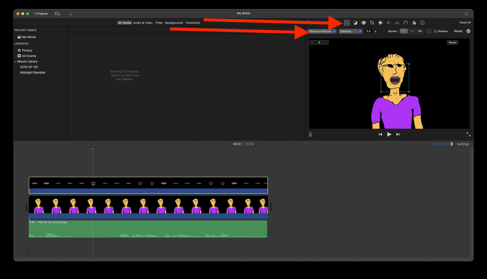

iMovie has no keyframing, so this suits a puppet that stays put. If the mouth
clip covers the face with a black rectangle, its transparency is not surviving
the import: switch the same menu to **Green/Blue Screen** and bring in the
**Chroma-key MP4** instead. Most Windows video editors have an equivalent pair of
features under different names.

### Final Cut Pro

Take the **Final Cut Pro project** export and **File > Import > XML** it. You get
a whole timeline built for you — one compound clip per clip — which you drag over
your puppet footage.

Then use Final Cut's own tracker: mask the face, track the movement, and attach
the mouths to it. That makes this the most flexible route by a good distance,
because the mouth can follow a puppet that moves. It is also the one that needs
software not everybody has.

Leave **Wrap … in a Compound Clip** ticked. Without it the mouths arrive as dozens
of loose one-frame pieces, and gathering them up is the first thing you would do
anyway.

### Straight from here, with nothing else

If you shot your puppet on video, you can finish in this page.

Load the video, pick a mouth style, then drag the mouth onto the face, size it
from the corner and tilt it with the knob. Turn on **Blur patch** to hide the
mouth printed on a doll or a minifigure, and export **Video with mouth overlay**.
The placement controls and that export only appear once a video is loaded, because
until then there is no picture to place anything on.

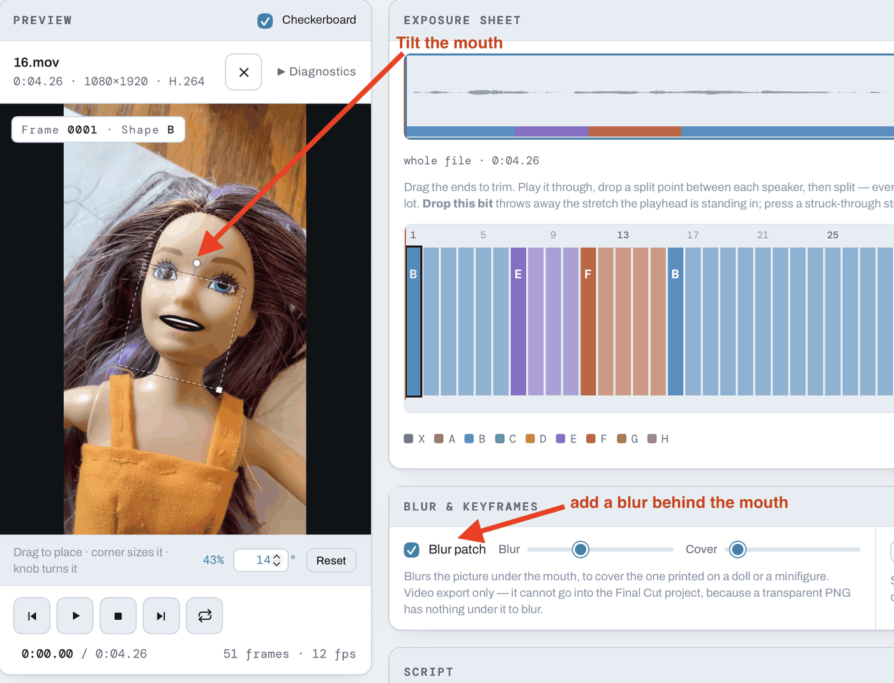

> ⚠️ **Lock the shot off**
>
> **Keyframes** are there for a puppet that moves, and in testing they do not
> earn their keep — the mouth slides about rather than sticking to the face.
> Shoot on a tripod, hold the angle, and this export is solid. When the puppet
> really has to move, that is the job Final Cut's tracker does properly.

### Puppets that are not facing you

The fifteen styles each come in three head angles — **Front**, **Three-quarter**
and **Profile** — so a puppet can be turned away or side on and still get a mouth
that belongs to it. They are the sub-tabs under **Built-in lips**; see
[Head angles](#head-angles).

---

## Keyboard shortcuts

| Key | Does | Where |
|-----|------|-------|
| <kbd>Space</kbd> | Play / pause | anywhere\* |
| <kbd>Home</kbd> | Jump to the start | anywhere\* |
| <kbd>End</kbd> | Jump to the end | anywhere\* |
| <kbd>X</kbd> <kbd>A</kbd>–<kbd>H</kbd> | Set the selected frames to that shape | exposure sheet |
| <kbd>←</kbd> <kbd>→</kbd> | Move the selection a frame | exposure sheet |
| <kbd>Shift</kbd> + <kbd>←</kbd> <kbd>→</kbd> | Extend the selection | exposure sheet |
| <kbd>Delete</kbd> | Clear the selection back to rest | exposure sheet |
| <kbd>Esc</kbd> | Collapse the selection to one frame | exposure sheet |
| <kbd>⌘A</kbd> / <kbd>Ctrl A</kbd> | Select every frame | exposure sheet |
| <kbd>⌘Z</kbd> / <kbd>Ctrl Z</kbd> | Undo | exposure sheet |
| <kbd>⇧⌘Z</kbd> / <kbd>Ctrl ⇧ Z</kbd> | Redo | exposure sheet |
| <kbd>←</kbd> <kbd>→</kbd> | Move between tabs | tab strip |
| <kbd>Shift</kbd> while turning | Snap the angle to 15° | stage |

\* Not while a field, menu or button has focus — there, the key belongs to that
control. Click an empty part of the page first and the transport keys come back.

---

## Limits

| | |
|---|---|
| Clips in the queue | 24 |
| Length of a queued clip | 60 seconds |
| Size of one batch download | 600 MB |

These are stated up front rather than discovered. A clip past the length limit
is flagged in the queue with a red dot and a note saying to work it on its own —
the single-clip path has no limit, and it is always the fallback.

A batch that would come to more than 600 MB stops and says so, rather than
handing the browser a file it cannot save. Frame sequences are the only export
that gets anywhere near this; everything else is orders of magnitude under.

---

## Troubleshooting

**The mouth chatters through silence.**
Raise the **silence gate**. A hissy or roomy recording sits further above the
noise floor than the analyser assumes.

**It flickers between shapes during speech.**
Raise the **minimum hold** to 3 frames. Anything shorter gets absorbed.

**The vowels are wrong.**
**Vocal tract size**. Lower it for a deep voice, raise it for a light one, until
"ee" and "oo" land on the shapes you expect.

**The batch only exported one clip.**
You are on an older build. A batch is one download now; if yours produces one
zip per clip, the browser is blocking the rest.

**Final Cut says the clips are missing.**
**File > Relink Files**, point it at the mouths folder, and they all reconnect at
once. Keeping the `.fcpxml` and its picture folders together avoids it entirely.

**The chroma-key edge is soft.**
Video chroma is half-resolution — that is the format, not the export. For a clean
matte use the **frame sequence** or the **Final Cut project**, both of which
carry real alpha.

**The GIF's edges are hard and the colours are flat.**
GIF transparency is one colour, not an alpha channel, and the palette is 255
colours. For a soft edge over video, use the frame sequence.

**My custom lips folder is not being found.**
The folder scan needs the page to be served over HTTP. Opened straight from disk,
browsers block it. Use **Use my own lips…** instead, which works everywhere.

**A video loads but shows no picture.**
The browser cannot decode that codec. The audio still analyses, and you can still
export everything except the overlay video. Re-wrapping the clip as H.264 fixes
it.

**The page went unresponsive.**
Decoding a long video blocks the browser for a few seconds. There is a spinner
that keeps turning through it — if you can see it turning, it has not crashed.

---

## Privacy

Nothing is uploaded. There is no server, no account, no analytics, and **no
network request of any kind** — not for your media, not for fonts, not for
anything. Everything the page needs travels inside it, typefaces included. The
audio is decoded in the page, analysed in the page, and written back out by the
page.

Custom lip sets you add with **Use my own lips…** live in memory for that visit
only: nothing is written to disk, nothing is stored in the browser, and reloading
clears them. Sets in a `lips/` folder beside the file are read from where they
already are.

You can put the whole thing on a USB stick and use it on a machine with no
network at all.
