# Lip Sync Generator

**Spoken audio in, viseme timing and transparent frames out.**

One HTML file. Open it in a browser and it works — no install, no account, no
server, nothing uploaded. Give it a voice track and it works out which mouth
shape belongs on every frame, shows you the result as an exposure sheet you can
correct by hand, and writes the mouths out in whatever form your animation tool
wants.

📖 **[Full user manual](docs/index.html)** — with annotated screenshots.
(GitHub shows HTML as source; open it locally, or switch on GitHub Pages for
the `docs/` folder to read it as a page.)

---

## Contents

- [What it's for](#what-its-for)
- [Quick start](#quick-start)
- [The window](#the-window)
- [Analysis](#analysis)
- [The exposure sheet](#the-exposure-sheet)
- [Trim, split and drop](#trim-split-and-drop)
- [Several clips at once](#several-clips-at-once)
- [Mouth style](#mouth-style)
- [Placing the mouth](#placing-the-mouth)
- [Exporting](#exporting)
- [Keyboard shortcuts](#keyboard-shortcuts)
- [Limits](#limits)
- [Troubleshooting](#troubleshooting)
- [Privacy](#privacy)

---

## What it's for

- a stop-motion puppet or minifigure that needs a mouth for each frame
- a 2D character in After Effects, Blender, Spine or a game engine
- a talking head in Final Cut Pro, cut over real footage
- a two-hander conversation split into lines, each with its own mouth

## Quick start

1. Open `lip-sync-generator.html` in Chrome, Edge, Safari or Firefox.
2. Drop a voice recording onto the **Preview** panel.
3. Wait a second — the exposure sheet fills in.
4. Press <kbd>Space</kbd> to watch it.
5. Go to **Export** and take whichever format you need.

> **Shortest useful path:** drop a WAV, press play, export the
> **Chart + exposure sheet**. Nine transparent PNGs and a JSON/CSV timing list,
> which is enough to drive almost any animation tool.

---

## The window


1. **Engine** — which analyser is running. Built-in DSP by default.
2. **Source** — where the file came from and how exports come back.
3. **Appearance** — light, match the system, or dark. It sticks between visits.

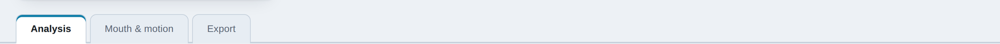

Everything above the tabs stays on screen whichever tab you're in, so you can
scrub the clip while you adjust a setting.

### Loading a clip


1. **Drop area** — drag a file here, or click to browse. WAV, MP3, M4A, OGG,
   FLAC, AAC, MP4, MOV, WebM. Drop several at once to start a queue.
2. **Stage** — where the mouth is drawn, over a checkerboard so you can see the
   transparency.
3. **Transport** — play, stop and scrub.

A **video** file is treated the same way: the soundtrack is analysed and the
picture becomes the backdrop, so you can place the mouth exactly where the face
is.

---

## Analysis

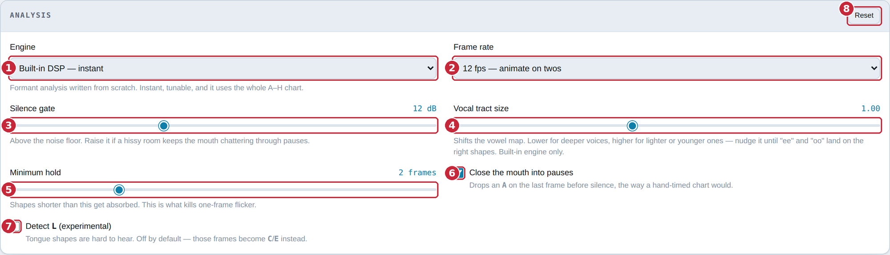

1. **Engine** — *Built-in DSP* is formant analysis written from scratch:
   instant, tunable, and it uses the whole A–H chart. *Rhubarb* is the
   PocketSphinx-based analyser, included for comparison.
2. **Frame rate** — 12 fps ("on twos") is the usual choice for character
   animation. **Set this before you start hand-editing**, since changing it
   re-times everything.
3. **Silence gate** — how far above the noise floor counts as speech. Raise it
   if a hissy room keeps the mouth chattering through pauses.
4. **Vocal tract size** — shifts the vowel map. Lower for deeper voices, higher
   for lighter ones. Built-in engine only.
5. **Minimum hold** — shapes shorter than this get absorbed. This is the control
   that kills one-frame flicker.
6. **Close the mouth into pauses** — drops an `A` on the last frame before
   silence, the way a hand-timed chart would.
7. **Detect L** — tongue shapes are hard to hear, so this is off by default.
8. **Reset** — every analysis setting back to its default.

> **Which knob first:** mouth flapping during silence → **silence gate**.
> Flickering during speech → **minimum hold**. Vowels simply wrong →
> **vocal tract size**.

---

## Preview and transport


1. **The loaded file** — name, length, sample rate, channels. **×** clears it.
2. **Frame and shape** — where the playhead is and what's showing.
3. **Stage** — the mouth at the current frame.
4. **Jump to the start** — <kbd>Home</kbd>
5. **Play / pause** — <kbd>Space</kbd>
6. **Stop** — stops and rewinds.
7. **Jump to the end** — <kbd>End</kbd>
8. **Loop** — respects a trim.
9. **Frame count** — how many frames at the current rate.

---

## The exposure sheet

One cell per frame, coloured and lettered by mouth shape, with the waveform
above it.

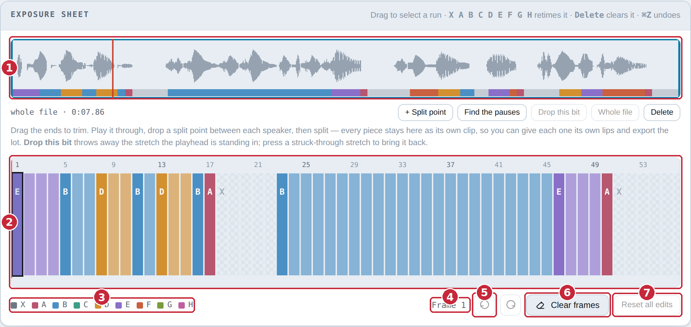

1. **Waveform** — the whole clip at a glance. Press anywhere to seek. Also where
   trimming and splitting happen.
2. **The sheet** — drag across it to select a run.
3. **Legend** — which colour is which shape.
4. **Selection** — what's selected, in frames and seconds.
5. **Undo / redo** — <kbd>⌘Z</kbd> and <kbd>⇧⌘Z</kbd>.
6. **Clear frames** — empties the selection back to rest.
7. **Reset all edits** — back to the raw analysis.

### The nine shapes

The Preston Blair set, which is also what Rhubarb writes.

| Key | Shape | Sounds |
|-----|-------|--------|
| `X` | Rest | silence |
| `A` | Closed | M, B, P |
| `B` | Slightly open | S, T, D, K, N, R, and "ee" |
| `C` | Open | "eh", "ae" |
| `D` | Wide open | "aa" |
| `E` | Rounded | "o", "aw", "er" |
| `F` | Puckered | "oo", W |
| `G` | Teeth on lip | F, V |
| `H` | Tongue | L |

**Every export ships all nine PNGs** even if the take only used five, so you can
correct a frame later without exporting again.

### Fixing frames by hand

1. Drag across the sheet to select frames.
2. Press the letter of the shape you want — <kbd>A</kbd>…<kbd>H</kbd>, or
   <kbd>X</kbd> for rest.
3. <kbd>Delete</kbd> clears a selection back to rest.

Hand edits survive a frame-rate change, a switch to another clip and back, and a
trim. Only **Reset all edits** throws them away.

---

## Trim, split and drop

All of this happens on the sheet's own waveform, which draws **the whole source
file** with the kept part boxed and anything discarded shaded and struck
through — so a piece you've cut off is still on screen and can be brought back.

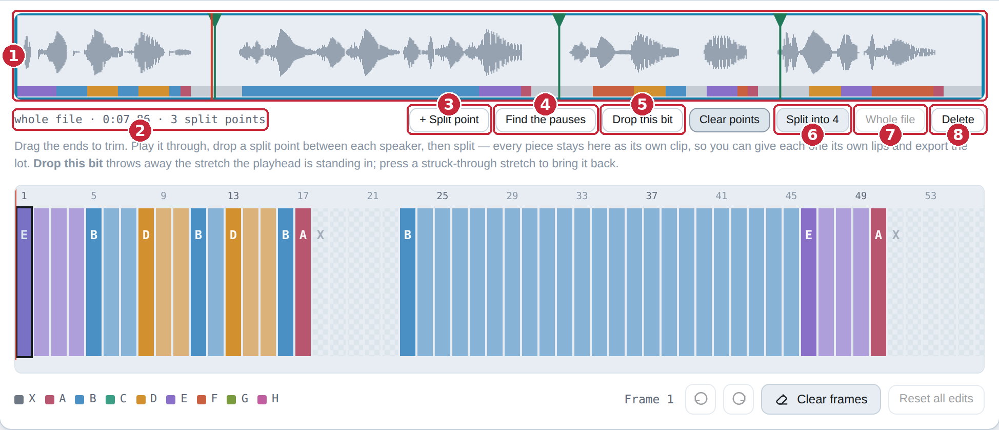

1. **The waveform** — drag either **end** to trim; press anywhere else to seek.
   The green flags along the top are split points: **drag a flag** to move it,
   **press and release without moving** to take it off.
2. **Readout** — what's kept, out of how long, and how many split points.
3. **+ Split point** — one where the playhead is.
4. **Find the pauses** — one in every pause the analyser found.
5. **Drop this bit** — throws away the stretch the playhead is in, bounded by
   the split points either side. The audio is genuinely removed and everything
   after it moves earlier. Press the struck-through stretch to bring it back.
6. **Split into N** — cuts at every split point at once, each piece becoming its
   own clip.
7. **Whole file** — undoes the trim and restores every dropped stretch.
8. **Delete** — removes this clip.

> **Two people talking:** load the recording, press **Find the pauses**, check
> the flags are in the right gaps, then **Split**. One clip per line. Now give
> the first speaker their mouth and press **Every other clip**, then do the same
> from the second clip.

---

## Several clips at once

Drop several files, or split one, and a queue appears. Only one clip is open at
a time; the rest keep their own edits, placement and mouth.

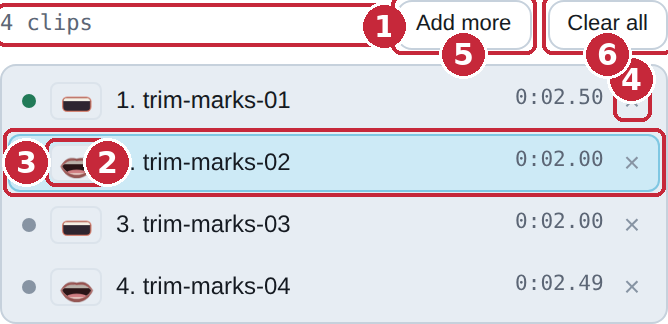

1. **Count** — how many clips are loaded.
2. **Lips** — the mouth that clip will be drawn with. This is what lets you see
   at a glance that two speakers are alternating.
3. **The open clip** — highlighted. Click any row to open it.
4. **×** — takes that clip out.
5. **Add more**
6. **Clear all**

**Shared across the queue:** engine, frame rate, analysis settings.
**Per clip:** frames and hand edits, mouth style, placement, keyframes, blur
patch, script.

---

## Mouth style

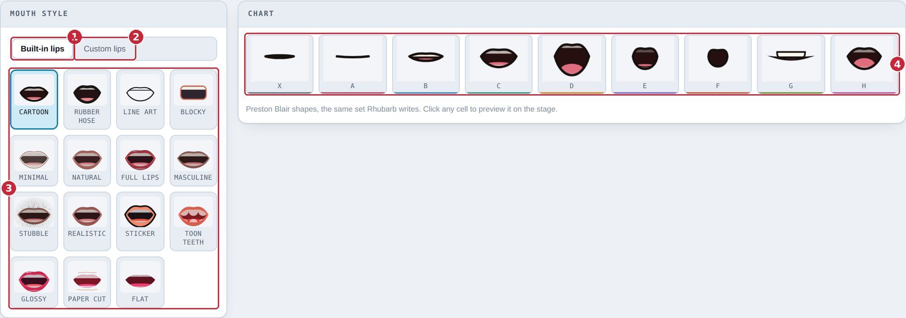

1. **Built-in lips** — fifteen drawn styles.
2. **Custom lips** — sets of pictures.
3. **The styles** — click one to use it. With a queue up it applies to the open
   clip only.
4. **Chart** — all nine shapes in the current style. Click a cell to preview it.

### Different lips per clip

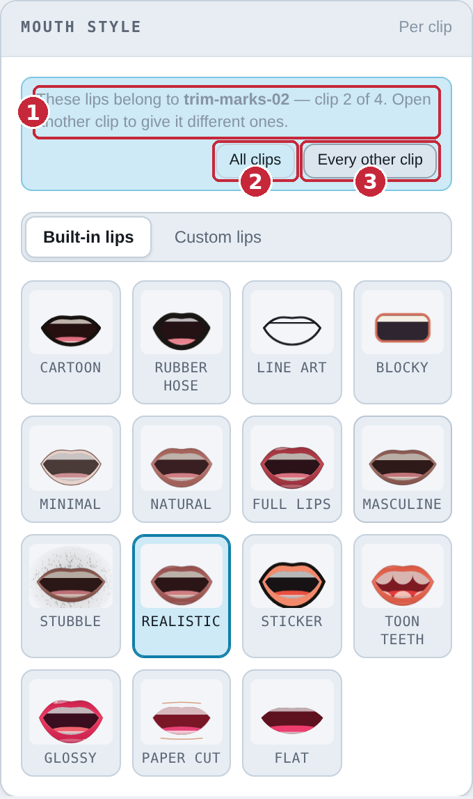

1. **Whose lips these are** — the picker belongs to the clip that is open.
2. **All clips** — give every clip in the queue these lips.
3. **Every other clip** — give them to this clip and every second one after it.
   This is the two-speakers-taking-turns case that splitting on the pauses
   produces.

### Your own lips

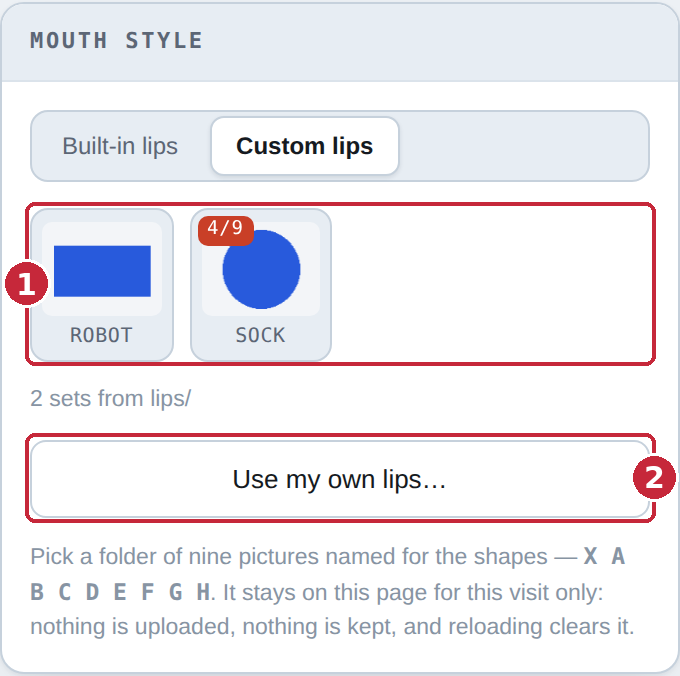

1. **The sets** — anything found in a `lips/` folder beside the HTML file when
   the page loaded, plus anything added this visit. A set showing `7/9` is
   missing shapes; the drawn style fills the gaps.
2. **Use my own lips…** — pick a folder of nine pictures named for the shapes:
   `X A B C D E F G H`. It stays on this page for this visit only.

To ship sets for everyone, put them in a `lips/` folder next to the HTML file —
one sub-folder per set, nine pictures inside each. They're found on load. This
needs the page served over HTTP; opened straight from disk, browsers block the
folder scan and **Use my own lips…** is the way in.

---

## Placing the mouth

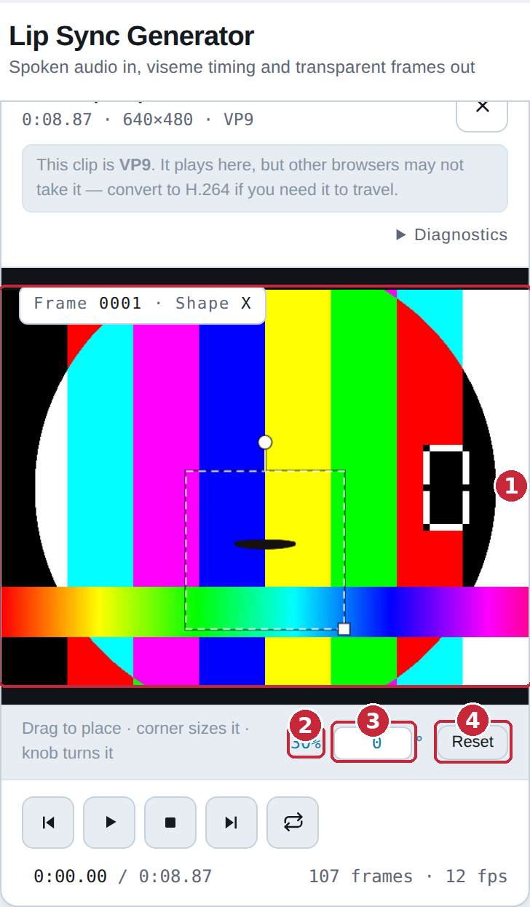

1. **The stage** — **drag** to move, drag the **corner** to size, drag the
   **knob** to turn. Hold <kbd>Shift</kbd> while turning to snap to 15°.
2. **Size** — as a percentage of the frame.
3. **Angle** — type an exact number of degrees.
4. **Reset**

The placement is **baked into the exported pictures**. A Final Cut project or a
frame sequence drops onto your timeline at 100% and lands exactly where the
preview showed it.

### Blur patch and keyframes


1. **Blur patch** — blurs the picture underneath the mouth, to cover the one
   printed on a doll or a minifigure.
2. **Blur** — how strong.
3. **Cover** — how much area.
4. **Keyframes** — turns keyframing on, so the mouth can follow a moving shot.
5. **‹ ›** — previous / next key.
6. **Set key**
7. **Delete key**
8. **Count**

With keyframes on, scrub to a frame and drag the mouth where it belongs — a key
is set there. Keys are anchored to *time*, so changing the frame rate or
trimming leaves them where they were.

⚠️ The blur patch and keyframed motion are baked into **Video with mouth
overlay** only. They can't go into the Final Cut project, because a transparent
PNG has nothing underneath it to blur.

---

## Exporting

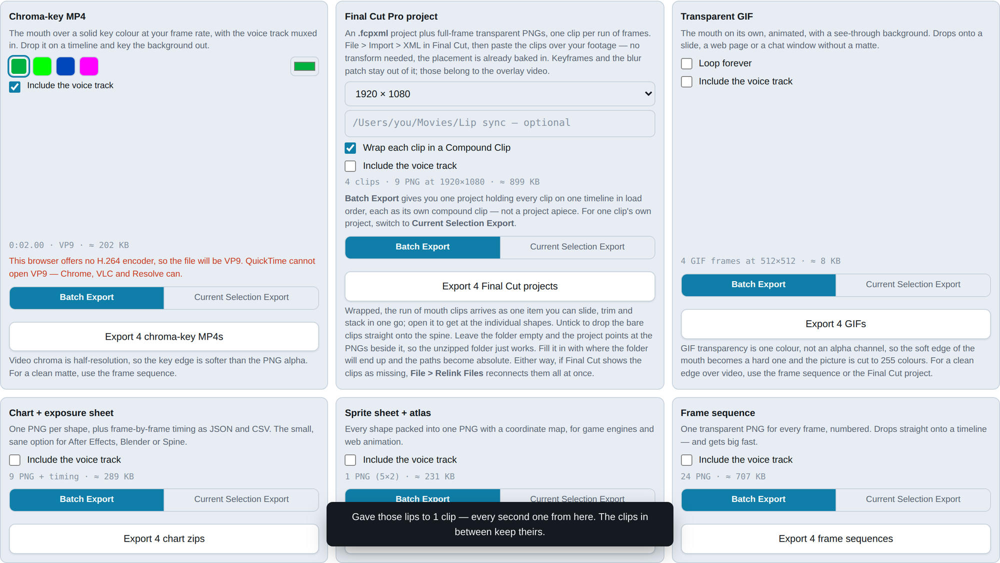

Every format is a card, and every card carries its own options and its own
button.


1. **Frame size** — "Match the video" is the right answer when cutting over that
   footage.
2. **Media folder** — leave it empty and the project points at the pictures
   beside it, so the unzipped folder just works.
3. **Wrap … in a Compound Clip** — the run of mouths arrives as one item you can
   slide, trim and stack, instead of dozens of one-frame pieces.
4. **Include the voice track** — off by default. Every card has its own.
5. **Estimate** — roughly what you're about to get.
6. **The button** — always says what it's about to do.

### The seven formats

| Format | You get | Good for |
|--------|---------|----------|
| **Chart + exposure sheet** | Nine transparent PNGs plus timing as JSON and CSV | After Effects, Blender, Spine — the small, sane option |
| **Final Cut Pro project** | An `.fcpxml` project plus full-frame transparent PNGs | Cutting over real footage. Import > XML, paste over your clip |
| **Transparent GIF** | An animated GIF with a see-through background | A slide, a web page, a chat window |
| **Sprite sheet + atlas** | One PNG with all nine shapes plus a coordinate map | Game engines, web animation |
| **Frame sequence** | One numbered transparent PNG per frame | The cleanest matte — and it gets big fast |
| **Chroma-key MP4** | The mouth over a solid key colour, voice muxed in | Any editor that can key |
| **Video with mouth overlay** | Your source video with the mouth burned in | A finished clip in one step. The only export carrying the blur patch and keyframed motion |

### Batch export

With more than one clip loaded, every card grows a two-way switch.

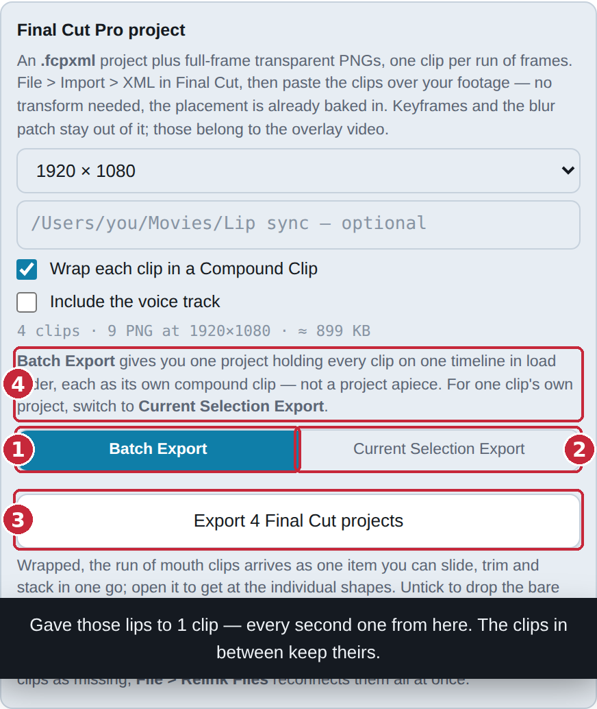

1. **Batch Export** — runs this format across every clip, using each clip's own
   edits, placement and mouth.
2. **Current Selection Export** — the open clip only.
3. **The button** — says which, and how many.
4. **Card note** — anything that differs between the two.

Each card decides for itself, so you can batch the GIFs while pulling a single
Final Cut project for the clip in front of you.

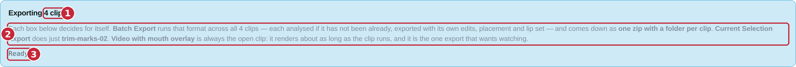

**What a batch hands you:** *one download*, a zip with a folder per clip inside.
Not one download per clip — a browser only lets a page start one download from a
click, and the rest get dropped, which looks exactly like "only the first clip
exported".

**Final Cut is the exception**, because its batch output is naturally a single
document: one project holding every clip on one timeline in load order, each as
its own compound clip — not a project apiece. For one clip's own project, switch
that card to **Current Selection Export**.

**Video with mouth overlay is never batched.** It renders roughly as long as the
clip runs, so it stays on the open clip.

Stopping mid-run still gives you a zip of whatever finished.

---

## Keyboard shortcuts

| Key | Does | Where |
|-----|------|-------|
| <kbd>Space</kbd> | Play / pause | anywhere\* |
| <kbd>Home</kbd> | Jump to the start | anywhere\* |
| <kbd>End</kbd> | Jump to the end | anywhere\* |
| <kbd>X</kbd> <kbd>A</kbd>–<kbd>H</kbd> | Set the selected frames to that shape | exposure sheet |
| <kbd>←</kbd> <kbd>→</kbd> | Move the selection a frame | exposure sheet |
| <kbd>Shift</kbd> + <kbd>←</kbd> <kbd>→</kbd> | Extend the selection | exposure sheet |
| <kbd>Delete</kbd> | Clear the selection back to rest | exposure sheet |
| <kbd>Esc</kbd> | Collapse the selection to one frame | exposure sheet |
| <kbd>⌘A</kbd> / <kbd>Ctrl A</kbd> | Select every frame | exposure sheet |
| <kbd>⌘Z</kbd> / <kbd>Ctrl Z</kbd> | Undo | exposure sheet |
| <kbd>⇧⌘Z</kbd> / <kbd>Ctrl ⇧ Z</kbd> | Redo | exposure sheet |
| <kbd>←</kbd> <kbd>→</kbd> | Move between tabs | tab strip |
| <kbd>Shift</kbd> while turning | Snap the angle to 15° | stage |

\* Not while a field, menu or button has focus — there, the key belongs to that
control. Click an empty part of the page first.

---

## Limits

| | |
|---|---|
| Clips in the queue | 24 |
| Length of a queued clip | 60 seconds |
| Size of one batch download | 600 MB |

Stated up front rather than discovered. A clip past the length limit is flagged
in the queue with a red dot and a note saying to work it on its own — the
single-clip path has no limit and is always the fallback.

---

## Troubleshooting

**The mouth chatters through silence.** Raise the **silence gate**.

**It flickers between shapes during speech.** Raise the **minimum hold** to 3
frames.

**The vowels are wrong.** **Vocal tract size** — lower for a deep voice, higher
for a light one.

**Final Cut says the clips are missing.** *File > Relink Files*, point it at the
mouths folder, and they all reconnect at once.

**The chroma-key edge is soft.** Video chroma is half-resolution — that's the
format, not the export. For a clean matte use the frame sequence or the Final
Cut project.

**The GIF's edges are hard and the colours flat.** GIF transparency is one
colour, not an alpha channel, and the palette is 255 colours. For a soft edge
over video, use the frame sequence.

**My custom lips folder isn't being found.** The folder scan needs the page
served over HTTP. Use **Use my own lips…** instead, which works everywhere.

**A video loads but shows no picture.** The browser can't decode that codec. The
audio still analyses; re-wrapping as H.264 fixes it.

**The page went unresponsive.** Decoding a long video blocks the browser for a
few seconds. If the spinner is still turning, it hasn't crashed.

---

## Privacy

Nothing is uploaded. There is no server, no account, no analytics and no network
request for your media. The audio is decoded in the page, analysed in the page,
and written back out by the page.

Custom lip sets added with **Use my own lips…** live in memory for that visit
only: nothing written to disk, nothing stored in the browser, and reloading
clears them.

You can put the whole thing on a USB stick and use it on a machine with no
network at all.

---

## Repository layout

```
lip-sync-generator.html     the app — this is the whole thing
docs/
  index.html                the user manual
  images/                   annotated screenshots
lips/                       optional: your own mouth sets, one folder each
```

The manual's screenshots are generated, not taken by hand: `manualshots.py`
drives the app with Playwright and draws each callout at the real bounding box
of the control it names. Re-run it after a UI change and the numbers follow the
buttons — or it fails, if a control it points at no longer exists.
